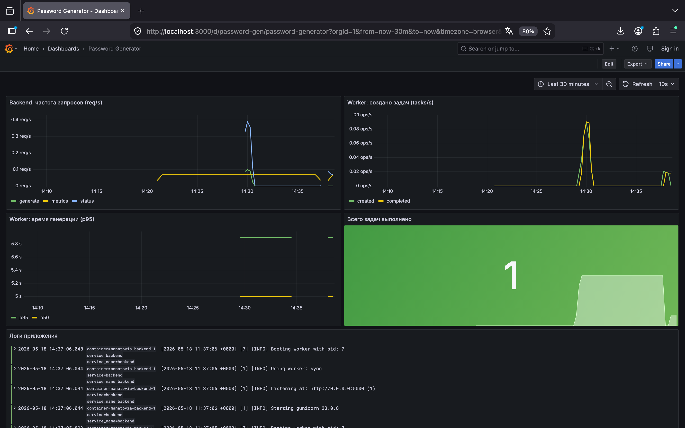

# Генератор паролей с мониторингом

Веб-приложение с микросервисной архитектурой для генерации паролей, дополненное стеком централизованного мониторинга.

## Архитектура приложения

```
Браузер
   ↓
gateway (Nginx, порт 8080)
   ├── /       → frontend (статический HTML/JS)
   └── /api/*  → backend (Flask, порт 5000)
                    ↓ HTTP
                 worker (Flask, порт 5001)
```

## Стек мониторинга

```
backend:5000/metrics ─┐
                       ├─→ Alloy → Mimir → Grafana
worker:5001/metrics ──┘

Docker logs ──────────→ Alloy → Loki  → Grafana
```

| Инструмент | Роль |
|------------|------|
| **Grafana Alloy** | Сбор метрик (scrape) и логов (Docker socket) |
| **Grafana Mimir** | Хранение метрик (Prometheus-совместимое) |
| **Grafana Loki** | Хранение логов |
| **Grafana** | Визуализация (порт 3000) |

## Собственные метрики

**backend** — счётчик HTTP-запросов:
```
backend_http_requests_total{method, endpoint, status}
```

**worker** — счётчик и гистограмма генерации паролей:
```
worker_tasks_created_total
worker_tasks_completed_total
worker_task_duration_seconds (histogram, buckets: 1–10s)
```

Метрики публикуются через эндпоинт `/metrics` каждого сервиса в формате Prometheus.

## Запуск

```bash
docker compose up --build
```

| Сервис | Адрес |
|--------|-------|
| Приложение | http://localhost:8080 |
| Grafana | http://localhost:3000 |

Grafana открывается без пароля. Дашборд **Password Generator** загружается автоматически.

## Дашборд



Дашборд включает:
- **Backend: частота запросов** — rate по эндпоинтам (req/s)
- **Worker: создано / выполнено задач** — rate (tasks/s)
- **Worker: время генерации** — гистограмма p50 / p95
- **Всего задач выполнено** — счётчик
- **Логи приложения** — живой поток из backend и worker

## Технологический стек

- Frontend: HTML + CSS + JavaScript (Nginx)
- Backend: Python + Flask + Gunicorn
- Worker: Python + Flask + Gunicorn + ThreadPoolExecutor
- Gateway: Nginx
- Мониторинг: Grafana Alloy + Loki + Mimir + Grafana
- Оркестрация: Docker Compose
